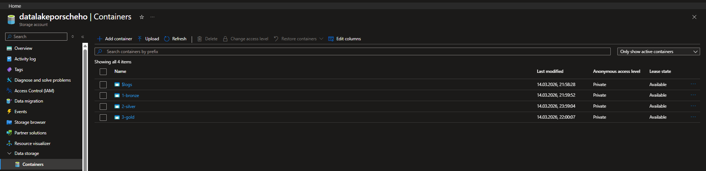
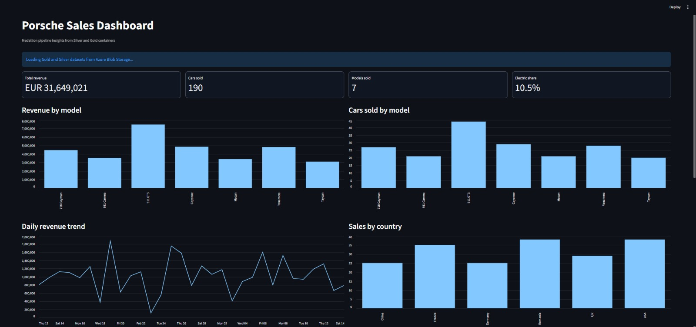
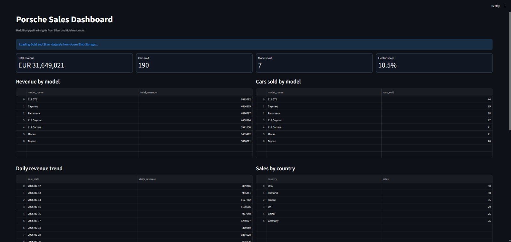
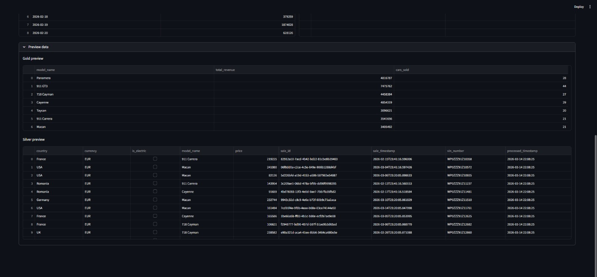

# Porsche Sales Medallion Pipeline

End-to-end Porsche sales analytics pipeline built with Python, PySpark, Azure Blob Storage, and Streamlit.
The project follows a Medallion architecture:

- `Bronze`: raw JSON sales events (`1-bronze`)
- `Silver`: cleaned and deduplicated parquet (`2-silver`)
- `Gold`: aggregated business metrics (`3-gold`)

## Project Components

- `01_generate_data.py` - Generates mock Porsche sales JSON files locally.
- `02_upload_bronze.py` - Uploads generated JSON files into Azure Bronze.
- `03_process_pyspark.py` - Runs Bronze -> Silver -> Gold transformations with logging and data-quality checks.
- `04_dashboard_streamlit.py` - Displays KPI cards and charts from Silver/Gold parquet data.

## Data Pipeline Logic

### Bronze -> Silver

- Reads JSON files directly from `1-bronze` using Spark (`abfss://...`).
- Removes invalid records (`price <= 0`).
- Drops rows with null/blank `vin_number`, `sale_id`, and `model_name`.
- Deduplicates by `vin_number`.
- Adds `processed_timestamp`.
- Writes parquet directly to `2-silver/sales/` in overwrite mode.

### Silver -> Gold

- Reads Silver parquet directly from `2-silver/sales/`.
- Aggregates by `model_name`:
  - `total_revenue = SUM(price)`
  - `cars_sold = COUNT(sale_id)`
- Writes Gold parquet directly to `3-gold/model_metrics/` in overwrite mode.

## Setup

### 1) Prerequisites

- Python 3.10+
- Java 8/11/17 (required by Spark)
- PySpark runtime with Azure connectors available, either:
  - preinstalled in a managed Spark runtime (Databricks/Synapse), or
  - provided through `SPARK_JARS_PACKAGES` for local Windows runs
- Azure Storage account with containers:
  - `1-bronze`
  - `2-silver`
  - `3-gold`

### 2) Install dependencies

```powershell
pip install -r requirements.txt
```

### 3) Configure credentials

Copy `.env.example` to `.env` and set a valid connection string:

```powershell
Copy-Item .env.example .env
```

`AZURE_CONNECTION_STRING` must point to account `datalakeporscheho` (or update script constants accordingly).

Optional (recommended for local Windows PySpark compatibility):

- `SPARK_JARS_PACKAGES` in `.env`, for example:
  - `org.apache.hadoop:hadoop-azure:3.3.2,com.microsoft.azure:azure-storage:8.6.6`

This project is configured to process data directly in Azure (`abfss://...`) without local staging folders.

## Run

### Generate and upload data

```powershell
python 01_generate_data.py
python 02_upload_bronze.py
```

### Process with Spark

```powershell
python 03_process_pyspark.py
```

### Launch dashboard

```powershell
streamlit run 04_dashboard_streamlit.py
```

## Operational Behavior and Error Handling

- Consistent timestamped logging is used across scripts.
- `03_process_pyspark.py` checks Bronze availability before processing.
- If Bronze has no JSON files, pipeline exits gracefully with actionable logs.
- Azure auth/resource errors are classified and logged explicitly for faster troubleshooting.
- Processing runs directly against Azure Data Lake paths (no local staging folders).
- Dashboard gracefully handles missing containers/data and shows guidance in-app.

## What Happens End-to-End

1. `01_generate_data.py` creates mock Porsche sale JSON files in `data_source/`.
2. `02_upload_bronze.py` uploads those files to Azure container `1-bronze`.
3. `03_process_pyspark.py` reads Bronze JSON directly from ADLS (`abfss://`).
4. Bronze -> Silver cleaning is applied:
   - removes `price <= 0`
   - removes null/blank key fields (`vin_number`, `sale_id`, `model_name`)
   - deduplicates by `vin_number`
   - adds `processed_timestamp`
5. Silver data is written to `2-silver/sales/` (overwrite).
6. Silver -> Gold aggregation computes `total_revenue` and `cars_sold` by `model_name`.
7. Gold data is written to `3-gold/model_metrics/` (overwrite).
8. `04_dashboard_streamlit.py` reads Silver/Gold parquet from Azure and renders KPIs + charts.

## 🛠️ AI-Driven Engineering & Collaboration

This project was developed using modern AI pair-programming practices to accelerate delivery and improve engineering quality.

- A conversational AI assistant (Gemini) was used for high-level system design, Medallion architecture planning, and data engineering learning support.
- An advanced coding agent (GPT-5.3-Codex) was used for implementation-heavy work, including PySpark transformations, debugging, and production-style error-handling refinements.

The result is a practical example of using AI as a productivity multiplier: faster iteration, clearer architecture decisions, and stronger implementation consistency.

## Security Notice: AI & Secret Management

When using AI coding assistants (Copilot, Cursor, GPT-based tools), protect cloud credentials with strict handling rules:

- Never paste connection strings, API keys, or other secrets into AI chat prompts.
- Close `.env` tabs after updating secrets; some assistants can use open editor context.
- If a key or connection string is exposed, rotate it immediately in Azure Portal (Regenerate Access Keys).

## ⚠️ Crucial Prerequisites for Windows Users

Running PySpark locally on Windows typically requires Hadoop native binaries.
Without them, Spark jobs may fail at runtime with filesystem/native dependency errors.

### Required setup

1. Download `winutils.exe` and `hadoop.dll` from a trusted Hadoop 3.3+ compatible repository.
2. Place both files in:
   - `C:\hadoop\bin\`
3. Set system environment variable:
   - `HADOOP_HOME=C:\hadoop`
4. Add this entry to your system `Path`:
   - `%HADOOP_HOME%\bin`
5. Restart IDE and terminal sessions to reload environment variables.

## Quick Troubleshooting

- `AZURE_CONNECTION_STRING is missing`: create/update `.env` and restart terminal.
- ABFS/connector class errors in local runs: set `SPARK_JARS_PACKAGES` in `.env` using versions that match your Spark/Hadoop runtime.
- `Bronze container was not found`: verify container name and storage account.
- `authentication/authorization error`: verify connection string validity and permissions.
- Dashboard shows no data: run `01_generate_data.py`, `02_upload_bronze.py`, then `03_process_pyspark.py`.
- `missing ScriptRunContext` warnings: launch dashboard with `streamlit run 04_dashboard_streamlit.py` (not `python 04_dashboard_streamlit.py`).

## Screenshots








